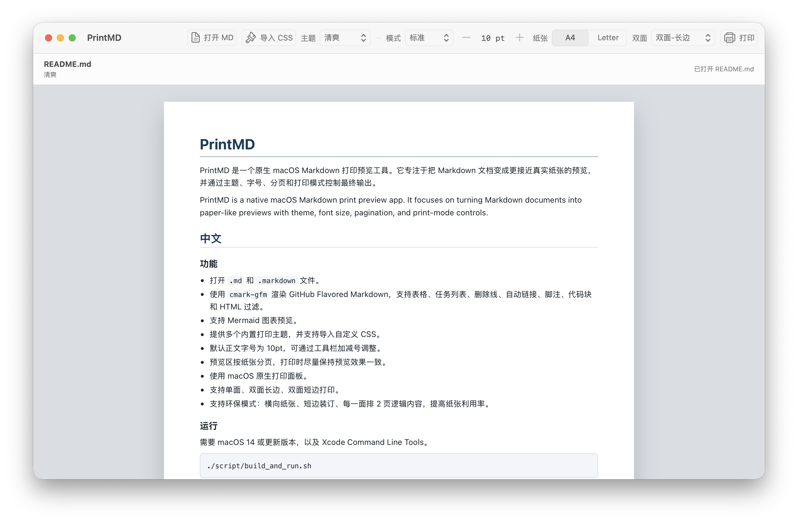

# PrintMD

PrintMD 是一个原生 macOS Markdown 打印预览工具。它专注于把 Markdown 文档变成更接近真实纸张的预览，并通过主题、字号、分页和打印模式控制最终输出。

PrintMD is a native macOS Markdown print preview app. It focuses on turning Markdown documents into paper-like previews with theme, font size, pagination, and print-mode controls.



## 中文

### 功能

- 打开 `.md` 和 `.markdown` 文件。
- 使用 `cmark-gfm` 渲染 GitHub Flavored Markdown，支持表格、任务列表、删除线、自动链接、脚注、代码块和 HTML 过滤。
- 支持 Mermaid 图表预览。
- 提供多个内置打印主题，并支持导入自定义 CSS。
- 默认正文字号为 10pt，可通过工具栏加减号调整。
- 预览区按纸张分页，打印时尽量保持预览效果一致。
- 使用 macOS 原生打印面板。
- 支持单面、双面长边、双面短边打印。
- 支持环保模式：横向纸张、短边装订、每一面排 2 页逻辑内容，提高纸张利用率。

### 运行

需要 macOS 14 或更新版本，以及 Xcode Command Line Tools。

```bash
./script/build_and_run.sh
```

只验证能否构建并启动：

```bash
./script/build_and_run.sh --verify
```

安装到 `/Applications` 并注册为 Markdown 文件的打开方式：

```bash
./script/build_and_run.sh --install
```

单独构建 SwiftPM 目标：

```bash
swift build
```

### 自定义主题

可以在工具栏中点击“导入 CSS”，选择自己的 CSS 文件覆盖内置主题。`Themes/sample-theme.css` 可以作为起点。

主题 CSS 主要作用在生成的打印 HTML 上，常见选择器包括：

```css
body {}
h1, h2, h3 {}
p, li {}
table, th, td {}
pre, code {}
blockquote {}
```

## English

### Features

- Opens `.md` and `.markdown` files.
- Renders GitHub Flavored Markdown through `cmark-gfm`, including tables, task lists, strikethrough, autolinks, footnotes, fenced code blocks, and filtered HTML.
- Supports Mermaid diagrams.
- Includes multiple built-in print themes and custom CSS import.
- Uses a 10pt default body font size with toolbar controls for increasing or decreasing it.
- Previews documents in paginated paper layout.
- Prints through the native macOS print panel.
- Supports single-sided, double-sided long-edge, and double-sided short-edge printing.
- Includes Eco mode: landscape paper, short-edge duplex, and two logical pages per printed side for better paper usage.

### Run

Requires macOS 14 or newer and Xcode Command Line Tools.

```bash
./script/build_and_run.sh
```

Verify build and launch:

```bash
./script/build_and_run.sh --verify
```

Install to `/Applications` and register as an opener for Markdown files:

```bash
./script/build_and_run.sh --install
```

Build the SwiftPM target only:

```bash
swift build
```

### Custom Themes

Use the toolbar CSS import button to load a custom CSS file over the current theme. `Themes/sample-theme.css` is a useful starting point.

The CSS applies to the generated print HTML. Common selectors include:

```css
body {}
h1, h2, h3 {}
p, li {}
table, th, td {}
pre, code {}
blockquote {}
```

## Open Source Components

- [`swift-cmark`](https://github.com/swiftlang/swift-cmark) / `cmark-gfm` for GitHub Flavored Markdown rendering.
- [`Mermaid`](https://github.com/mermaid-js/mermaid) for diagram rendering.
